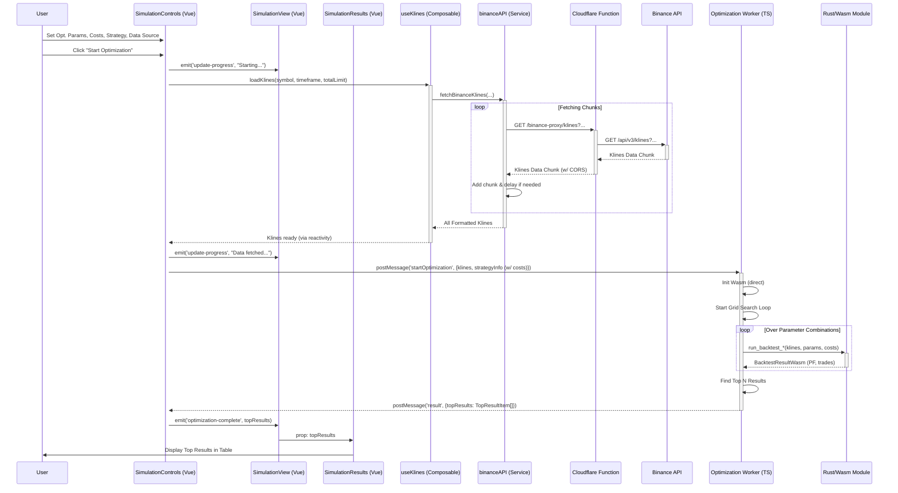
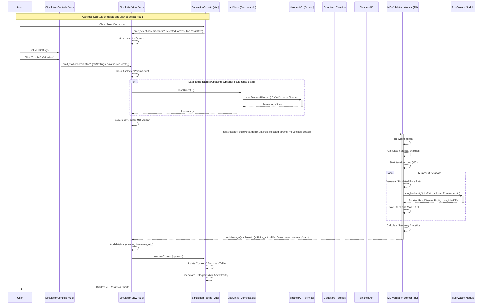

# Monte Carlo Trading Strategy Simulation Dashboard

[](https://github.com/engan/mc-simulations/actions/workflows/rust.yml)
[](https://opensource.org/licenses/MIT) <!-- Optional: Choose and add a license -->

A web-based dashboard for backtesting trading strategies and evaluating their robustness using Monte Carlo simulations. Built with Vue 3 (TypeScript) for the frontend and Rust compiled to WebAssembly (Wasm) for high-performance calculations.


## Overview

The primary goal of this project is to provide a tool for traders and quantitative analysts to:

1.  **Optimize Strategy Parameters:** Quickly find potentially effective parameter sets (e.g., SMA periods, RSI period) for a chosen trading strategy by running a grid search against historical market data.
2.  **Validate Robustness:** Thoroughly evaluate the performance distribution and risk profile of selected parameters using Monte Carlo simulations. These simulations generate numerous possible future price paths based on historical dynamics (Bootstrapping) and run the strategy on each path.

This process helps distinguish potentially robust strategies from those whose historical performance might be due to chance or curve-fitting.

## Features ✨

- **Data Fetching:**
  - Loads historical K-line (candlestick) data from the Binance Spot API.
  - Supports fetching **extended history** (> 1000 bars) by automatically making multiple API requests.
  - Includes basic rate-limit handling.
- **Strategy Support:**
  - Implements backtesting and optimization logic for:
    - SMA (Simple Moving Average) Crossover
    - RSI (Relative Strength Index) (fixed buy/sell levels)
  - Framework designed for adding more strategies.
- **Step 1: Grid Search Optimization:**
  - Optimizes relevant parameters for the selected strategy (e.g., SMA periods, RSI period).
  - Calculates metrics like Profit Factor and Trade Count for each parameter set.
  - Displays the top N performing parameter sets.
- **Step 2: Monte Carlo Validation:**
  - Runs thousands of simulated price paths using bootstrapping based on historical price changes.
  - Performs backtests on each simulated path using the user-selected parameters and **configurable costs**.
  - Includes basic simulation for:
    - **Commission:** Percentage-based cost per trade.
    - **Slippage:** Fixed amount added/subtracted from entry/exit prices.
  - Generates distributions for key outcome metrics:
    - Profit/Loss (%)
    - Maximum Drawdown (%)
  - Calculates summary statistics (Average, Median, Percentiles/VaR) across all simulations.
- **Web Worker Integration:** Offloads computationally intensive tasks (Optimization, MC Simulations) to Web Workers, keeping the UI responsive.
- **Interactive Dashboard:**
  - Built with Vue 3 (Composition API, `<script setup>`) and TypeScript.
  - Allows user configuration of: Data Source (Symbol, Timeframe, Total Data Limit), Strategy Selection, Strategy Parameters (ranges for optimization), Backtest Costs (Commission, Slippage), and Monte Carlo Settings (Iterations, Bars per Simulation).
- **Visualization:** Uses ApexCharts to display P/L and Max Drawdown histograms from Monte Carlo results.
- **Transparency:** Displays simulation context, including strategy, parameters, costs, MC settings, and the historical data period used.

## Technology Stack 🛠️

- **Frontend:**
  - [Vue 3](https://vuejs.org/) (Composition API with `<script setup>`)
  - [TypeScript](https://www.typescriptlang.org/)
  - [Vite](https://vitejs.dev/) (Build Tool & Dev Server)
  - [Vue3 ApexCharts](https://github.com/apexcharts/vue3-apexcharts) (Charting Library)
  - [pnpm](https://pnpm.io/) (Package Manager, Workspaces)
- **Backend / Computation Logic:**
  - [Rust](https://www.rust-lang.org/) (High-performance calculations)
  - [WebAssembly (Wasm)](https://webassembly.org/) (Target for Rust compilation)
  - [wasm-pack](https://rustwasm.github.io/wasm-pack/) (Build tool for Wasm package)
  - [Cargo](https://doc.rust-lang.org/cargo/) (Rust Package Manager)
  - [web-sys](https://rustwasm.github.io/wasm-bindgen/api/web_sys/) (for `console_log`)
- **Data Source:**
  - [Binance API](https://binance-docs.github.io/apidocs/spot/en/) (for historical K-line data)

## Project Structure 📁

```text
mc-simulations/
├── frontend/             		        # Vue.js Frontend Application
│   ├── public/
│   ├── src/              		        # Frontend source code
│   │   ├── assets/       		        # CSS files (base.css, main.css)
│   │   ├── components/   		        # Vue UI Components
│   │   │   ├── SimulationControls.vue
│   │   │   └── SimulationResults.vue
│   │   ├── composables/  		        # Reusable Vue logic
│   │   │   └── useKlines.ts
│   │   ├── router/  			        # Vue router (index.ts)
│   │   ├── stores/       		        # Pinia state management (counter.ts)
│   │   ├── rust/pkg/     		        # Generated Wasm package (output location)
│   │   ├── services/     		        # API interaction
│   │   │   └── binanceAPI.ts
│   │   ├── types/        		        # Shared TypeScript types
│   │   │   └── simulation.ts
│   │   ├── views/        		        # Main application views
│   │   │   └── SimulationView.vue
│   │   ├── workers/      		        # Web Workers (Optimization, MC Validation)
│   │   │   ├── optimizationWorker.ts
│   │   │   └── mcValidationWorker.ts
│   │   ├── App.vue       		        # Main Vue application component
│   │   └── main.ts       		        # Vue app entry point
│   ├── index.html
│   ├── package.json      		        # Frontend package manifest
│   ├── vite.config.ts    		        # Vite config (incl. dev proxy)
│   └── ...               		        # Other config files (tsconfig, eslint, etc.)
│
├── functions/                          # Cloudflare Pages Function(s)
│   └── binance-proxy/                  # Handles /binance-proxy/* routes
│       └──[[path]].ts                  # Proxy logic for Binance API
│
├── src/                  		        # Rust Library Source Code
│   └── lib.rs           		        # Backtesting logic, Wasm bindings
│
├── .gitignore
├── .vscode/              		        # VS Code settings (settings.json, extensions.json)
├── Cargo.toml            		        # Rust dependencies and workspace info
├── Cargo.lock
├── package.json          		        # Root package manifest (for workspace)
├── pnpm-workspace.yaml   		        # Defines pnpm workspace (should be at root)
└── README.md             		        # This file
```

_(Note: The exact location of the `pkg` directory might depend on `wasm-pack` output configuration, often placed inside `frontend/src/rust/` or directly at the root/`frontend` level for easier import.)_

## Data Flow and Component Interaction

To better understand how data flows through the application and how the different components (Vue frontend, Web Workers, Rust/Wasm, API proxy) interact during the two main processes (Optimization and Monte Carlo Validation), the following sequence diagrams are included.

**Important Notes on Viewing:**

- **On GitHub:** These diagrams are rendered automatically directly on this page by GitHub. Depending on your screen size, **you might need to zoom in** your browser to see the details clearly.
- **Locally (e.g., in VS Code):** For a good live preview while editing `README.md`, you can install a Markdown extension that supports Mermaid, such as **"Markdown Preview Mermaid Support"**. This is only for your local editor and is not required for the diagrams to be displayed on GitHub.

### Participant Legend

- **User**: End User interacting with the UI.
- **SC**: `SimulationControls.vue` (Vue component for input).
- **SV**: `SimulationView.vue` (Main Vue component, orchestrator).
- **SR**: `SimulationResults.vue` (Vue component for displaying results).
- **UK**: `useKlines.ts` (Vue Composable for fetching/managing K-line data).
- **BA**: `binanceAPI.ts` (Service layer for calls to Binance API via proxy).
- **Proxy**: Cloudflare Worker or Vite Dev Proxy (Handles CORS).
- **Binance API**: External data source from Binance.
- **OW**: `optimizationWorker.ts` (Web Worker for Optimization - Step 1).
- **MCW**: `mcValidationWorker.ts` (Web Worker for Monte Carlo - Step 2).
- **Wasm**: Compiled Rust/WebAssembly Module (Core calculations/backtesting).

---

### Flow 1: Optimization (Step 1)

This diagram shows the process from the user initiating the optimization until the results are displayed.



---

### Flow 2: Monte Carlo Validation (Step 2)

This diagram shows the process after the user selects a parameter set from Step 1 and initiates the Monte Carlo validation.



## Getting Started 🚀

### Prerequisites

- [Node.js](https://nodejs.org/) (LTS version recommended) and [pnpm](https://pnpm.io/installation)
- [Rust](https://www.rust-lang.org/tools/install) (stable toolchain)
- [wasm-pack](https://rustwasm.github.io/wasm-pack/installer/):
  ```bash
  cargo install wasm-pack
  ```

### Installation & Running

1.  **Clone the repository:**

    ```bash
    git clone https://github.com/engan/mc-simulations.git
    cd mc-simulations
    ```

2.  **Install all dependencies (Root + Frontend):**

    - Run from the root directory (mc-simulations/):

    ```bash
    pnpm install
    ```

3.  **Build the Rust/Wasm package:**

    - Run from the root directory (mc-simulations/):
    - This compiles Rust to Wasm and places it in frontend/src/rust/pkg/.
    - (Optional: You can add "build:wasm": "wasm-pack build --target web --out-dir ./frontend/src/rust/pkg" to the root package.json scripts and run pnpm run build:wasm).

    ```bash
    wasm-pack build --target web --out-dir ./frontend/src/rust/pkg
    ```

4.  **Run the Frontend Development Server:**
    - Option 1: Navigate to frontend and run:
      ```bash
      cd frontend
      pnpm run dev
      ```
    - Option 2: Run from the root directory:
      ```bash
      pnpm --filter frontend run dev
      ```
    - Open your browser and navigate to the local URL provided by Vite (usually http://localhost:5173 or similar). The Vite proxy should handle CORS for Binance API calls during development.

## Deployment (Cloudflare Pages)
- The project is configured for automatic deployment via GitHub Actions upon pushing to the master branch.
- Static Assets: Built by Vite (using base: '/') and placed in frontend/dist.
- SPA Routing: Handled by the frontend/public/_routes.json file recognized by Cloudflare Pages.
- API Proxy: The Cloudflare Pages Function in functions/binance-proxy/index.ts proxies requests starting with /binance-proxy/ to the official Binance API, adding necessary CORS headers.

## Usage Guide 📖

1.  **Access the Dashboard:**
    - Open the Live Demo here: https://mc-simulations.pages.dev or run locally.
2.  **Configure Data Source:**
    - Enter the desired trading `Symbol` (e.g., `SOLUSDT`).
    - Set Timeframe (e.g., 1h, 15m, 1d). Use Binance API format (e.g., 'm' for minutes).
    - Specify the total Data Limit (e.g., 10000 for 10k bars). The app will fetch data in chunks.
3.  **Select Strategy:**
    - Choose between SMA Crossover and RSI using the dropdown.
4.  **Configure Strategy Parameters (for Step 1 Optimization):**
    - Set the ranges (Min, Max, Step) for the parameters relevant to the selected strategy (SMA periods or RSI period).
5.  **Configure Backtest Costs:**
    - Set Commission (%) per trade (e.g., 0.05 for 0.05%).
    - Set Slippage (Amount) in absolute price units (e.g., 0.01).
6.  **Run Optimization (Step 1):**
    - Click Start Optimization (Step 1).
    - Data is fetched (potentially in multiple requests).
    - The optimization worker runs grid search backtests (including costs) using Rust/Wasm.
    - A table shows the top N parameter sets ranked by Profit Factor.
7.  **Select Parameters for Validation:**
    - Click Select on a row in the results table.
8.  **Configure Monte Carlo Settings (Step 2):**
    - Set Iterations and Bars per Sim.
9.  **Run Monte Carlo Validation (Step 2):**
    - Click Run MC Validation (Step 2).
    - The MC worker generates simulated paths and runs backtests (including costs) using Rust/Wasm.
10.  **Analyze MC Results: View the Context, Summary Statistics, and P/L & Max Drawdown histograms.**

## Current Status & Roadmap 🏗️

- **Status:** Core functionality implemented for SMA Crossover and basic RSI strategies, including optimization, Monte Carlo validation with costs, and extended data fetching.
- **Known Limitations:**
  - Backtesting logic is still somewhat simplified (basic slippage model, no advanced order types, drawdown calculation approximation).
  - Limited number of strategies and indicators.
  - UI could be improved (loading states, error feedback).
- **Next Steps / Possible Improvements:**
  - Implement more realistic slippage models.
  - Add more complex backtest metrics (Sharpe Ratio, Sortino, Win Rate etc.).
  - Implement more strategies (e.g., Bollinger Bands, MACD).
  - Refactor strategy handling for easier extension and potential combinations.
  - Make RSI Buy/Sell levels configurable/optimizable.
  - Add ability to save/load configurations or results.
  - Implement detailed backtest view (Equity Curve, Trade List).

## License 📄

This project is licensed under the MIT License - see the [LICENSE](LICENSE.md) file for details.

---

_Feel free to contribute or report issues!_
